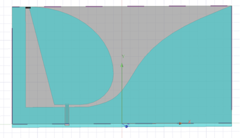
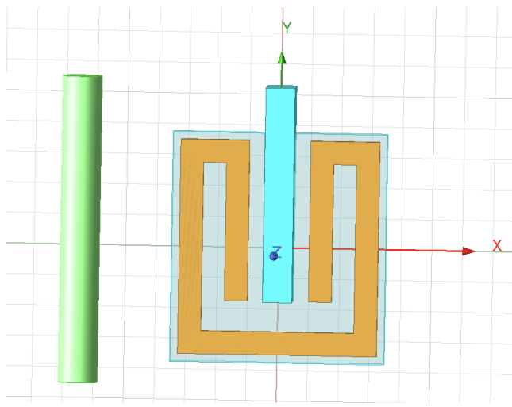
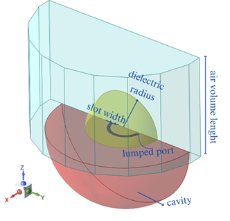

# ITU Electronics and Communications Engineering Student

### Skills
- Programming Languages: Python, C, C++, MATLAB, java
- Software Tools:  ANSYS HFSS, CST, MS Office, tensorflow
- Languages: Fluent English and Turkish, Beginner Spanish

## Education			        		
- B.S., Electronics and Communications Engineering | Istanbul Technical University (June 2025)

## Work Experience
**Undergraduate Reasearcher @ Bountenna Antennas and Propagation Laboratory (_June 2022 - Present_)**
- Bountenna Antennas & Propagation Research Lab.
-Duties includes: Antenna, biodegradable sensor and phantom design
-Software used: Ansys HFSS, CST
-Supervisor: Assoc. Prof. Sema Dumanlı-Oktar

# Gülsüm Beyza Altundal - Portfolio

Welcome to my project portfolio! Here you will find an overview of my projects, including descriptions and technologies used.

---

## Projects

### 📡 [Tapered Slot Antenna Design for Ground Penetrating Radar Applications](files/gpr.pdf)
: This project focused on the design and analysis of a Dielectric Resonator Antenna (DRA), which offers superior efficiency and bandwidth performance for modern wireless applications. Using ANSYS HFSS, the DRA geometry, material properties, and feed mechanism were optimized to meet target frequency and gain requirements.

- **Technologies:** ANSYS HFSS
- 

---

### 🎵 [Generative Music AI using LSTM Networks](files/AI.pdf)
An AI system that composes original music using LSTM neural networks trained on MIDI datasets. By learning patterns in melodies and harmonies, the model generates creative musical sequences.

- **Technologies:** Matlab, MIDI Toolbox
- [View Project on GitHub](https://github.com/beyzilop/Music-AI)

---

### 🌱 Split Ring Resonator (SRR)-Based Sensor for Plant Growth Estimation
This project introduces a sensing system based on Split Ring Resonators (SRR) for contactless estimation of plant growth. By tracking resonance frequency shifts caused by changes in plant biomass and water content, the system offers a non-invasive alternative to traditional plant monitoring methods

- **Technologies:** ANSYS HFSS
- 

---

### 📶 [Dielectric Resonator Antenna Design and Simulations](files/dra.pdf)
This project focused on the design and analysis of a Dielectric Resonator Antenna (DRA), which offers superior efficiency and bandwidth performance for modern wireless applications. Using ANSYS HFSS, the DRA geometry, material properties, and feed mechanism were optimized to meet target frequency and gain requirements

- **Technologies:** ANSYS HFSS
- 

---

## About Me

I studied Electronics and Communication Engineering, which gave me a strong foundation in technology, systems, and problem-solving. However, during my studies, I discovered a growing passion for coding and software development. That’s why Commencis stands out to me — as a company at the forefront of digital transformation, it offers the ideal environment for me to develop my coding skills, learn from experienced professionals, and contribute to cutting-edge projects. I’m excited to take this step and transition into the software field, combining my analytical background with new programming skills to build my career in technology..

---

## Contact

You can also check out my GitHub profile for more projects: [beyzilop](https://github.com/beyzilop)

- [YouTube](https://www.youtube.com/@BeyzaAltundal)
- [Linkedin](https://www.linkedin.com/in/beyza-a-005081171/)

